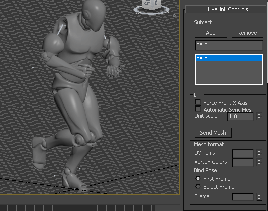
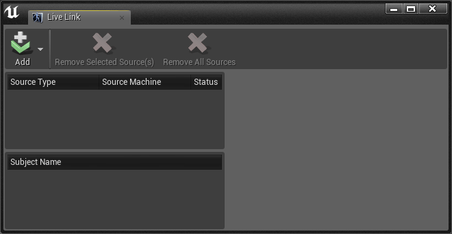
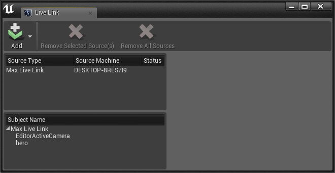
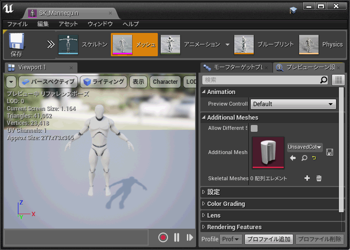
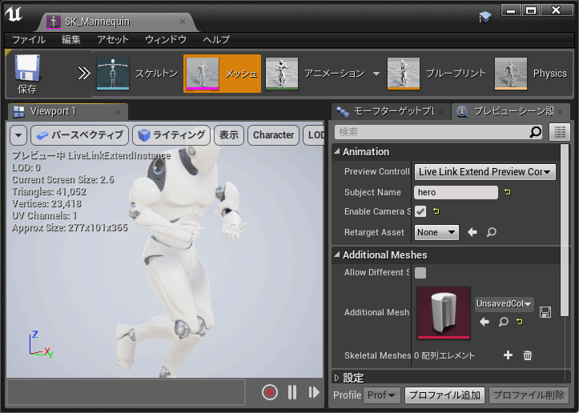
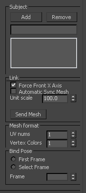

# ue4-3dsMax-livelink

　3ds Max でも Unreal Engine の Live Link Plugin の機能を使用できるようにして、  
若干の機能拡張を行ったプラグインです。

## 機能概要

以下の機能が実装されています。

* 3ds Max との Live Link 機能の対応
* 通常の Live Link Plugin のビューにてサポートしていない画角同期への対応
* 3ds Max 上でのスケルタルメッシュデータを同期する機能の追加
 

## 使用方法

### UE4 での操作  

　通常の「Live Link Perview Controller」と使用方法は変わりません。  

- 3ds Max側にてSubjectを追加して
 

- UE4 の Live Link ウィンドウを開き
 

- [Add] -> [Message Bus Source] から [Max Live Link] を選択して
 

- コンテンツブラウザからプレビューしたいスケルタルメッシュのアセットを開き
 

- プレビューシーン設定にて「Live Link Extend Perview Controller」を選んで、  
登録したSubjectを[Subject Name]に入力することで同期が行われます。
 
> *カメラの同期を使用する場合は[Enable Camera Sync]にチェックを入れてください。*

その後のプレビュー内での操作は3dsMaxから行います。
 

### 3dsMax での操作  

 

* Subject  
	Live Link にて同期させる対象に関する項目です。

	テキストボックスにSubjectの名前を入力して、  
	「Add」ボタンを押すことで選択中、またはすべてのオブジェクトが  
	1つのSubjectとしてUE4への同期単位として追加されます。  

	リストボックスの内容を選択して「Remove」ボタンを押すと、  
	Subjectを破棄します。

* Link  
	同期方法に関する項目です。

	* Force Front X Axis
		X軸が前方向に設定されたスケルタルメッシュと同期する場合は  
		「Force Front X Axis」にチェックを入れてください。

	* Send Mesh
		「Send Mesh」ボタンを押すことで、  
		メッシュがプレビューに同期されます。
		> *同期はアセットの上書きとして行われますので、保存などにはご注意ください。*

	* Automatic Sync Mesh
		「Automatic Sync Mesh」にチェックを入れると、  
		メッシュデータの更新が行われるときに  
		自動でLive Linkプレビューへの反映も行われるようになります。  
		> *この項目はメッシュデータの大きさにも依存しますが、大きく負荷がかかる可能性がありますので、ご注意ください。*

	* Unit scale  
		表示の単位スケールの設定です。  
		UE4 と 3dsMax間にて設定が異なる場合にご調整ください。

* Mesh format  
	メッシュ同期に使用されるフォーマットの項目となります。

	* UV nums 
		頂点が使用するUVの数を指定できます。

	* Vertex Colors
		頂点カラーの数を指定できます。
		> *2まで設定できますが、現在は 0 と 1 のみ対応されています。*

* Bind Pose
	メッシュ同期の際に頂点構築に使用する、  
	バインドポーズ（Tポーズ）として使用するフレームの項目となります。
	> *バインドポーズが入っていないデータにて、メッシュ同期を行うと正常にメッシュが反映されない可能性があります。*
	
	* First Frame  
		一番最初のフレームの状態をバインドポーズとみなします。

	* Select Frame  
		Frame 項目にて指定されたフレームをバインドポーズとみなします。

## インストール方法

### 3ds Max へのインストール

　3dsMaxのバージョンに対応した、 plugin/3dsMax ～ の中の dlu ファイルを、  
プラグインフォルダに格納することでユーティリティとして使用できます。

　
### Unread Engine 4 へのインストール

## 同期について

　メッシュ同期は、UVの数や頂点カラー使用数のような  
頂点フォーマットに対しても変更が行え、
モーフターゲットに関してもサポートしております。

しかし、UE4上のアセットを直接変更し、もとに戻す機能も実装されておりません、  
そのため、保存の際などにご注意ください。  

　また、バインドポーズが設定されていないメッシュについては、  
正しく同期が行われない可能性がありますのでご注意ください。

また、もともとは Live Link Plugin の実装を利用したものですので、  
UVアニメーションなどのボーンアニメーション以外のアニメーションの同期は行えません。  
要望などがあれば対応いたします。

